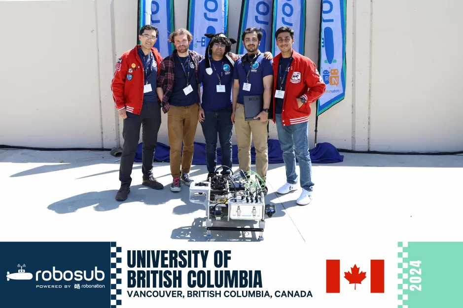
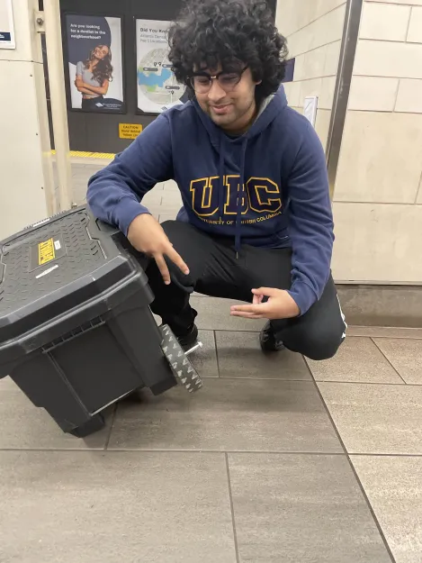

### UBC Subbots Engineering Design Team
**Software, Sound Localization Subteams**  
*October 2023 – Present*  
Vancouver, BC

     
    
    

- Modularized Python-based sound localization software with real-time data pipelines, enabling integration with our submersible’s C++ system.
- Configured and set up hardware by enabling global SSH access on Linux systems using ngrok, allowing the team to securely remote into devices.
- Updated submersible’s ROS2 version to improve compatibility, streamlining development for 13+ students.

### UBC Sauder School of Business
**Learning Services Undergraduate Academic Assistant**  
*September 2023 – Present*  
Vancouver, BC

- Delivered comprehensive IT and AV support to faculty, facilitating flawless class operations while producing edited recordings of lectures that enhanced the learning experience for 300+ students per term.
- Identified and proposed optimizations to inefficiencies by researching Workday REST calls to reduce shift logging time by 50% and developing Python scripts to cut down on inefficiency.
- Assisted in organizing the Learning Analytics Hackathon with 80+ participants, setting up meetings, and providing advice on various aspects, contributing to its successful execution.

### Lotus Addiction Therapy
**Software Engineer**  
*December 2023 – July 2024*  
Caledon, ON

- Developed and integrated secure authentication systems, implementing JWT Web Tokens, booking functionalities, and payment processing through Stripe, using the PERN Stack.
- Dockerized the PostgreSQL database, reducing setup & ensuring consistency across developer environments.
- Leveraged pgAdmin4 for database management & Postman to create RESTful routes, reducing testing time by 70%.

### igniteXL Ventures
**AI Venture Capital Deal Sourcing Extern**  
*April 2024 – May 2024*  
Palo Alto, CA

- Utilized platforms like Crunchbase & theOrg to perform in-depth research & Perplexity for prompt engineering.
- Produced and presented a concise and impactful VC investment summary incorporating research insights.

### The Shine Network Institute
**Application Developer**  
*December 2023 - April 2024*  
Toronto, Ontario, Canada

- Contributed to the planning and redesigning of a course focused on indigenous awareness to make it more mobile-friendly, increasing accessibility to a wider audience. (Signed an NDA)
